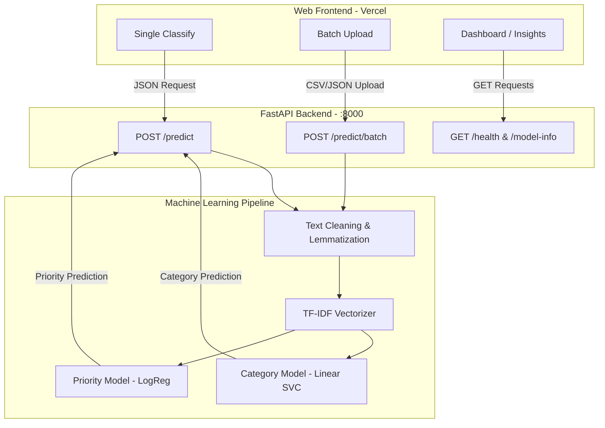

# 🎫 SupportMind — AI-Powered Ticket Classification System

<div align="center">
  
  
  
  
  
</div>

<br>
<p align="center">
  An end-to-end <strong>Machine Learning system</strong> that automatically classifies IT support tickets into categories and predicts priority levels. Built with a robust scikit-learn ML pipeline, a high-performance FastAPI backend, and a modern glassmorphism web UI.
</p>

---

## 📑 Table of Contents
- [🚀 Live Demo](#-live-demo)
- [✨ Core Features](#-core-features)
- [📸 Screenshots](#-screenshots)
- [🏗️ Architecture](#-architecture)
- [📊 ML Model Performance](#-ml-model-performance)
- [⚡ Quick Start Guide](#-quick-start-guide)
- [🌐 Deployment](#-deployment)
- [🔌 REST API Reference](#-rest-api-reference)
- [🧠 How the AI Works](#-how-the-ai-works)
- [📁 Project Structure](#-project-structure)
- [🤝 Contributing](#-contributing)
- [📄 License](#-license)

---

## 🚀 Live Demo

> **Frontend**: Deployed on Vercel — [View Live App](https://future-ml-02.vercel.app)
>
> ⚠️ The live frontend requires a running backend API. To test the full AI pipeline locally, please follow the [Quick Start Guide](#-quick-start-guide) below.

---

## ✨ Core Features

### 🔍 Single Ticket Classification
Paste any support ticket text and receive instant AI-powered predictions, complete with confidence scores and full probability distributions across all categories and priorities.

### 📊 Batch Processing via CSV
Upload a CSV file containing hundreds of tickets. The system processes them in bulk, displays the results in a fully sortable and filterable data table, and allows you to export the AI's predictions as a new CSV file.

### 📈 Advanced Insights Dashboard
A comprehensive dashboard featuring model evaluation metrics, interactive category/priority distribution charts, and per-class performance breakdowns.


## 🏗️ Architecture



---

## 📊 ML Model Performance

Our models have been rigorously trained and evaluated using 5-fold cross-validation.

### Category Classifier (8 classes)
| Metric | Score |
|--------|-------|
| **Accuracy** | 85.78% |
| **F1 Score (macro)** | 86.05% |
| **Precision (macro)** | 88.01% |
| **Best Model** | Linear SVC |

### Priority Classifier (3 classes)
| Metric | Score |
|--------|-------|
| **Accuracy** | 82.93% |
| **F1 Score (macro)** | 82.42% |
| **Precision (macro)** | 82.48% |
| **Best Model** | Logistic Regression |

### Cross-Validation Comparison

| Model | Category F1 | Priority F1 |
|-------|------------|------------|
| **Linear SVC** ✅ | **0.851** | 0.814 |
| **Logistic Regression** | 0.847 | **0.816** ✅ |
| **Random Forest** | 0.842 | 0.815 |
| **Multinomial NB** | 0.765 | 0.760 |

---

## ⚡ Quick Start Guide

Follow these steps to set up the project locally for development and testing.

### Prerequisites
- **Python**: v3.10 or higher
- **Git**: For cloning the repository
- **pip**: Python package manager

### 1. Clone the Repository

```bash
git clone https://github.com/shsumukha381-ui/FUTURE_ML_02.git
cd FUTURE_ML_02
```

### 2. Install Dependencies

```bash
# Create a virtual environment (recommended)
python -m venv venv
source venv/bin/activate  # On Windows use: venv\Scripts\activate

# Install requirements
pip install -r requirements.txt
```

### 3. Add the Dataset

Download the **Classification of IT Support Tickets** dataset from [Zenodo](https://zenodo.org/records/7648117) and place the CSV in the `data/raw/` directory:

```
data/raw/all_tickets_processed_improved_v3.csv
```

### 4. Train the Models

```bash
python -m src.run_training
```

This step takes approximately 5–10 minutes. It generates:
- Trained and serialized models saved in the `models/` directory.
- Comprehensive evaluation reports and confusion matrices saved in the `reports/` directory.

### 5. Start the Backend API

```bash
uvicorn backend.main:app --host 0.0.0.0 --port 8000 --reload
```
The API will be available at `http://localhost:8000`. You can view the interactive API documentation at `http://localhost:8000/docs`.

### 6. Open the Frontend

You can simply open the `public/index.html` file in your browser, or serve it locally:

```bash
python -m http.server 5500 --directory public
```
Navigate to `http://localhost:5500` in your web browser. The frontend is pre-configured to connect to the local backend API at `:8000`.

---

## 🌐 Deployment

### Frontend (Vercel)

The frontend is designed to be hosted as a static site on Vercel.

1. Fork this repository.
2. Go to [Vercel](https://vercel.com) → **Add New Project** → Import your fork.
3. Vercel will automatically detect the `vercel.json` configuration file.
4. Click **Deploy**.

### Backend (Render / Railway / Heroku)

To use the live frontend, you must deploy the FastAPI backend. You can easily deploy it on platforms like [Render](https://render.com) using the included `render.yaml` blueprint.

Once your backend is deployed, connect your frontend to it by setting the API URL in your frontend's environment or directly in the browser console:
```javascript
window.API_BASE_URL = 'https://your-production-backend-url.com';
```

---

## 🔌 REST API Reference

The FastAPI backend provides robust endpoints for predictions and system monitoring.

### `GET /health`
Verifies that the API is running and the ML models are successfully loaded into memory.
```json
{ 
  "status": "healthy", 
  "model_loaded": true 
}
```

### `GET /model-info`
Retrieves metadata about the loaded ML models, including accuracy metrics and training timestamps.

### `POST /predict`
Classifies a single support ticket.

**Request:**
```bash
curl -X POST http://localhost:8000/predict \
  -H "Content-Type: application/json" \
  -d '{"text": "My laptop screen is broken and I need a replacement urgently"}'
```

**Response:**
```json
{
  "category": "Hardware",
  "category_confidence": 0.98,
  "priority": "High",
  "priority_confidence": 0.97,
  "category_probabilities": { "Hardware": 0.98, "Access": 0.01, "Network": 0.01 },
  "priority_probabilities": { "High": 0.97, "Medium": 0.02, "Low": 0.01 }
}
```

### `POST /predict/batch`
Classifies multiple tickets in a single request. Useful for batch processing from JSON payloads.

### `POST /predict/upload`
Accepts a CSV file upload containing a `text` column, processes all rows, and returns a JSON array of predictions.

---

## 🧠 How the AI Works

### Ticket Categorization
1. **Text Preprocessing**: The system lowercases all text, removes punctuation, filters out stopwords using NLTK, and applies lemmatization.
2. **Feature Extraction**: It uses a TF-IDF (Term Frequency-Inverse Document Frequency) vectorizer configured to extract up to 10,000 unigram and bigram features.
3. **Classification**: A robust Linear Support Vector Classifier (Linear SVC) analyzes the features to predict the ticket's category.

### Priority Prediction
Because the original dataset lacks priority labels, the system intelligently derives them during training based on:
- **Category Urgency**: Network/Access issues are elevated to High priority, whereas general inquiries default to Low.
- **Urgency Keywords**: Words like "urgent", "critical", or "ASAP" automatically increase the priority.
- **Text Complexity**: Exceptionally long or detailed tickets often signify complex, escalated issues.

The ML models learn these underlying patterns purely from the text. During production inference, the model predicts priority strictly based on the text contents without needing explicit hardcoded rules.

> 📖 **Deep Dive**: Check out [notebooks/NOTEBOOK.md](notebooks/NOTEBOOK.md) for a comprehensive, non-technical explanation designed for project stakeholders.

---

## 📁 Project Structure

```
FUTURE_ML_02/
├── data/
│   └── raw/                 # Ignored: Place your CSV dataset here
├── notebooks/
│   └── NOTEBOOK.md          # Plain-language explanation of the AI pipeline
├── src/                     # Core Machine Learning Pipeline
│   ├── config.py            # Hyperparameters and mappings
│   ├── preprocessing.py     # Text cleaning and dataset loading
│   ├── features.py          # TF-IDF & Feature engineering
│   ├── train.py             # Model training & serialization
│   ├── evaluate.py          # Performance metrics & reports
│   └── run_training.py      # Entry point for training pipeline
├── models/                  # Ignored: Saved .joblib model files
├── reports/                 # Evaluation output (e.g., confusion matrices)
├── backend/                 # FastAPI Backend Application
│   ├── main.py              # API Routes and core logic
│   ├── schemas.py           # Pydantic data validation models
│   └── requirements.txt     # Backend specific dependencies
├── public/                  # Static Frontend UI
│   ├── index.html           # Main Application Dashboard
│   ├── styles.css           # Custom Dark Glassmorphism CSS
│   └── app.js               # Frontend logic and API integration
├── render.yaml              # Render deployment configuration
├── vercel.json              # Vercel deployment configuration
├── requirements.txt         # Global Python dependencies
└── README.md                # Project documentation
```

---

## 🤝 Contributing

Contributions make the open-source community an amazing place to learn, inspire, and create. Any contributions you make are **greatly appreciated**.

1. Fork the Project
2. Create your Feature Branch (`git checkout -b feature/AmazingFeature`)
3. Commit your Changes (`git commit -m 'Add some AmazingFeature'`)
4. Push to the Branch (`git push origin feature/AmazingFeature`)
5. Open a Pull Request

---

## 📄 License

This project is built for educational and portfolio purposes. It is distributed under the MIT License. 

Training data is sourced from the publicly available [Classification of IT Support Tickets Dataset](https://zenodo.org/records/7648117) on Zenodo.

---

<p align="center">
  Built with ❤️ by <a href="https://github.com/shsumukha381-ui">shsumukha381-ui</a> as part of the Future Interns ML Internship.
</p>
